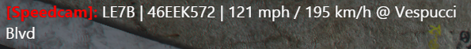
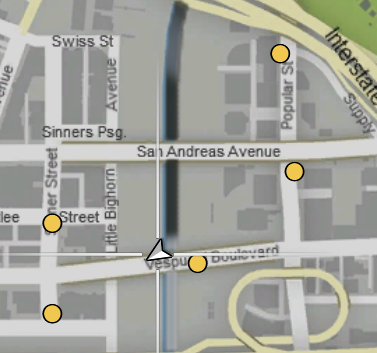

# StationaryRadar
## Description

This script allows you to set multiple stationary radars that trigger if players drive too fast.




## Requirements

* MySQL database

## Current Features

* show / hide blips for stationary radars
* flashing radars if a player drives too fast
* permissions for who can use all these features

### Commands
All commands require a permission level of 1

* /show radars - Shows yellow blips on all radar spots
* /hide radars - Hides all blips
* /set speedradar - Sets a stationary radar at your current position
* /remove speedradar - Removes the radar at your current position

## Installation

Edit the server.lua and set your database host, schema, user and password
```lua
MySQL:open("localhost", "gta", "root", "1234")
```

Execute the following sql command on your database
```sql
CREATE TABLE `stationaryradar` (
  `x` double(8,2) NOT NULL,
  `y` double(8,2) NOT NULL,
  `z` double(8,2) NOT NULL,
  `maxspeed` int(11) NOT NULL
);

CREATE TABLE `stationaryradar_permissions` (
  `steamid` varchar(255) NOT NULL,
  `name` varchar(255) NOT NULL,
  `permission_level` int(11) NOT NULL,
  PRIMARY KEY (`steamid`)
);
```

Players will be automatically added to the permissions table once they enter your server.

You have to set their permission_level to 1 if they should be able to use this script.
